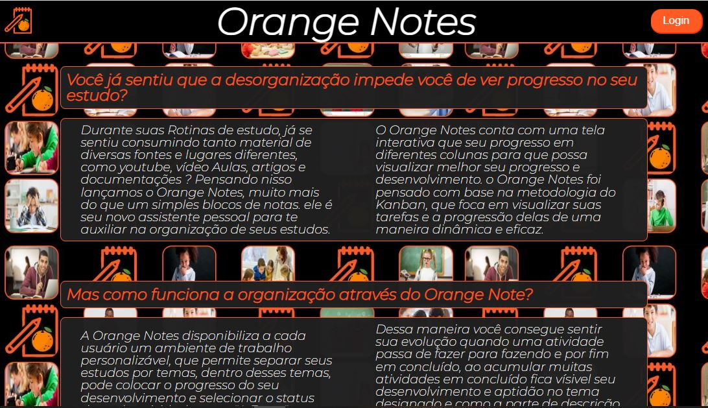
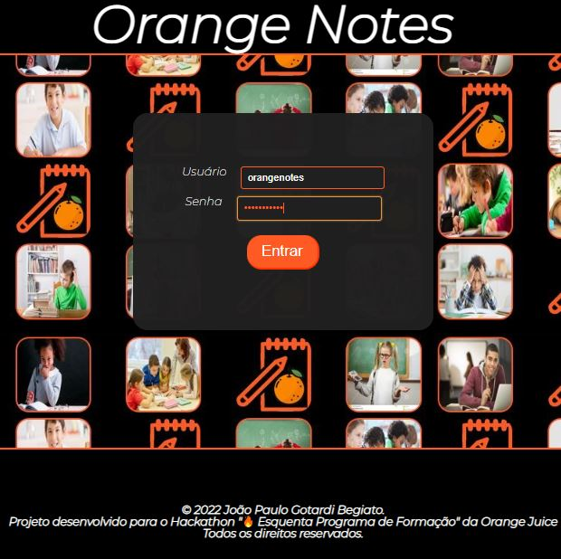
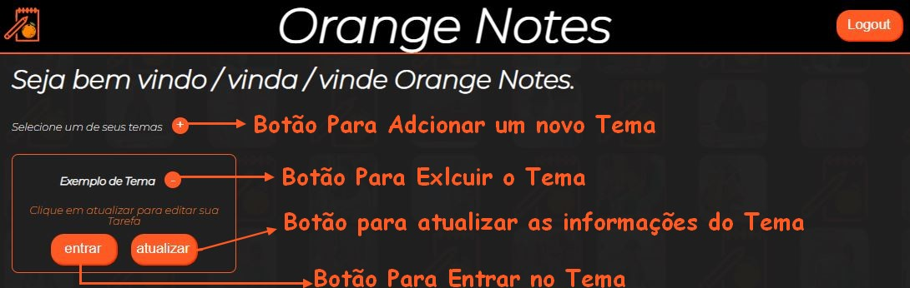
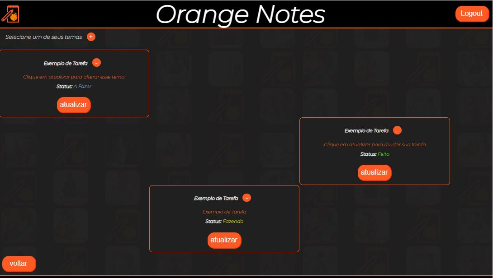
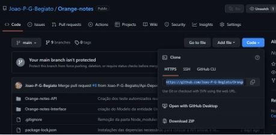

# Lançamento de produto: **Orange Notes** 🍊

## Projeto desenvolvido para o Hackaton 🔥 Esquenta Programa de Formação 🔥 da Orange Juice.

[Sobre](#sobre-) - [Softwares & Ferramentas](#softwares--ferramentas-utilizadas-neste-projeto-) - [Deploy](#deploy-) - [Consumo da API](#consumo-da-API-) - [Licença](#licenca-) [Contato](#contato-)

## Sobre 🔎    

***Problemática*** 😨  

Quando estamos no processo de aprendizado, acabamos consumindo conteúdos sobre diversos assuntos, seja através de cursos, vídeo aulas, artigos  entre outros.
Isso acaba desorganizando o dia a dia de estudo, criando o sentimento de que não estamos progredindo, e consequentemente, não evoluímos nessa busca pelo conhecimento."

Diante da nossa problemática surge o **Orange Notes**, uma plataforma onde as pessoas poderão organizar seus cursos, vídeo aulas, artigos e tudo que envolve aprendizado em um local só, podendo ver seu progresso.

---

***Conceito*** 💡  

Pensando na problemática, percebi que os pontos mais importantes seriam: Organização e Visualização do progresso, para solucionar essas questões tomei como base o Kanban que é uma metodoliga ágil que auxilia na organização de projetos e tarefas bem como traz uma visualização clara tanto que está sendo feito, do que já foi concluído e o que ainda precisa ser feito. Acredito que esse fator visual é muito importante, por isso na hora de produzir a aplicação web tomei como meta duas coisas, trazer esse impacto visual para o usuário, bem como uma aplicação simples de fácil uso, pois durante esse processo de aprendizado é muito importante ter ao seu dispor ferramentas facéis de utilizar. 

Levando em consideração esses fatos levantados no paragráfo anterior estrutrei a aplicação para receber notas textuais chamadas de tarefas que recebem um título, uma descrição e um status, além de ter cores diferentes para cada status (A Fazer Roxo, Fazendo Amarelo e Feito verde) também define em qual coluna que a tarefa aparece, sendo A Fazer ocupa a coluna esquerda da tela, Fazendo ocupa a coluna central e Feiot ocupa a coluna direita da tela, trasmitindo uma maior sensação de progresso hora que você começa a visualizar que suas tarefas na coluna de Feito.

---

## Softwares & Ferramentas utilizadas neste projeto 📚

- HTML5
- CSS3
- JavaScript
- React
- Vite
- React-Router-Dom
- Node.js
- API Rest
- Express
- SQLite 3
- Dot env
- Nodemon
- Jest
- Git
- GitHub

---

### ***Banco de Dados*** 💾
Importante lembrar que, as informações alimentadas não ficarão salvas para sempre, pois o banco de dados utilizado acaba sofrendo um reset para o estado incial dele, aquele que estava quando foi feito o deploy, toda vez que o heroku faz a aplicação da API entrar no modo de stand by, para economizar consumo de dados e processamento.

Por mais que tenha uma simulação de login e validação de senha, como é um MVP (Minimo Produto Viável) ainda não tem todos os requisitos de segurança da informação, por isso optei por manter dessa maneira para não correr o risco de expor as informações alimentadas no banco.

---


## Deploy 🚀

### ***Utilização da aplicação web*** 📝:

A Aplicação Web recebeu seu deploy pelo heroku e pode ser acessada pelo link: [Orange Notes](about:blank)

você irá acessar a landing page:



clicar em login em seguida será mandado para tela de Login, a validação criada para login funciona apenas com o login e senha de teste:
```
Login: orangenotes
Senha: orangenotes
```

em seguida será encaminhado para a pagina Home que contém os temas de estudo:  
Botão de login:  

  
Tela de Login:  

  

Tela com os temas:  

  

Ao clicar para entrar em um dos temas você vai para a tela de tarefas daquele tema onde suas tarefas estarão distribuídas:  

  

---

### ***Utilização para Desenvolvimento*** ⚙️

Primeiramente será necessário clonar esse repositório, você acessar pelo terminal a pasta aonde quer clonar o repositório e rodar o seguinte comando:

```
git clone https://github.com/Joao-P-G-Begiato/Orange-notes.git
```
ou então acessar atracés do [repositorio do GitHub](https://github.com/Joao-P-G-Begiato/Orange-notes) clicar em code e depois Download ZIP:   

  

---

### ***Instalão das dependencias*** :

*Front-end REACT* 💠 :   

Para trabalhar com o front-end em react, depois de clonar o repositório precisará instalar as dependências do vite e do react, para isso rode os seguintes comandos no terminal:

acesse a pasta da interface da aplicação WEB:
```
cd Orange-notes-Interface
```
e depois peça para instalar as depências necessárias:
```
npm i
```
esse comando irá baixar todas as dependencias necessárias para rodar a aplicação.

depois para visualizar a aplicação nessa mesma pasta rode o comando:

```
npm run dev
```

---

*Back-end Node.js* 🌐 :   

Para trabalhar com o back-end em node, depois de clonar o repositório precisará instalar as dependências do node, para isso rode os seguintes comandos no terminal:

acesse a pasta da interface da aplicação WEB:
```
cd Orange-notes-API
```
e depois peça para instalar as depências necessárias:
```
npm i
```
esse comando irá baixar todas as dependencias necessárias para rodar a aplicação.

depois para subir a aplicação, nessa mesma pasta rode o comando:

```
npm run dev
```

---

### ***Instalação do Node*** 🔧:

caso não tenha o Node instalado precisará seguir o seguinte passo-a-passo:

*Windows: 🔰*


Você pode baixar direto pelo site: [node](https://nodejs.org/en/)

Ou então via Chocolatey:
```
choco install nodejs-lts
```

*Mac: 🍎*

Você pode baixar direto pelo site: [node](https://nodejs.org/en/)

*Linux:🐧* 

via apt e snap:

```
sudo apt-get install curl

curl -fsSL https://deb.nodesource.com/setup_lts.x | sudo -E bash -

sudo apt-get install -y nodejs
```

---

### ***Insomnia*** 🌃:

Caso não tenha nenhum programa para testar o consumo da API eu recomendo baixar o Insomnia, porém pode-se utilizar alguns online como o [hoppscotch](https://hoppscotch.io/pt-br/) ou [postman](https://www.postman.com/)

*Windows: 🔰*

Você pode baixar pelo site: [Insomnia](https://insomnia.rest/download)

ou então via Chocolatey
```
choco install insomnia-rest-api-client
```
*Mac:🍎*

via brew:
```
brew install --cask insomnia
```

*Linux: 🐧*

via snap:
```
snap install insomnia
```

---

## Consumo da API 🤖

Para realizar o cosumir a API você poderá utilizar os métodos GET, PUT, POST e DELETE conforme descritos abaixo, para realizar todas as funções do CRUD(criar, ler, atualizar e deletar) você tem que utilizar o método especifico:

### Método Get (Ler):

O método GET é feito para exibir os registros da API e pode ser utilizado de duas maneiras:

1. Selecionar todos os registro de Usuário, Para isso utilize o método GET na rota user: 
https://orange-notes-api.herokuapp.com/user

2. Selecionar apenas um resgistro filtrado pelo Login. Para isso complemente o link da rota com "/login".
Ex.: https://orange-notes-api.herokuapp.com/user/orangenotes

### Método POST (Criar):

O método POST é feito para criar novos registros na API e para ser utilizado deve-se preencher o corpo da requisição conforme modelo abaixo e utilizar a rota: https://orange-notes-api.herokuapp.com/user   

Se as informações passadas no corpo da requisição passarem nas validações ele irá criar um novo item dentro da entidade escolhida com um id único, gerado automáticamente.   
  
### Método PUT (atualizar):

O método PUT é feito para atualizar os registros existentes e para ser utilizado deve-se preencher o corpo da requisição conforme modelo abaixo e utilizar a rota com o complemento do id do registro que irá ser alterado".

Ex.: https://orange-notes-api.herokuapp.com/user/1

Se as informações passadas no corpo da requisição passarem na validação ele irá alterar o registro escolhido através do id único passado na rota.

**Método DELETE**

O método DELETE é feito para excluir um registro e para ser utilizado deve-se usar a rota com complementando do id do registro que irá ser excluído.

Ex.: https://orange-notes-api.herokuapp.com/user/1

Ele irá deletar o resgitro escolhido através do id único passado na rota.

---  

*Modelo Padrão do corpo da Requisição:*
*obs: Lembrando que os itens de um Objeto são compostos por chave:valor, a chave precisa ser a mesma do modelo, porém o valor pode mudar.* *Ex: "nome": "Fulano de Tal"*  

```javascript
{
    "nome": "Nome Exemplo",
    "login": "loginexemplo",
    "tolken": "10100101",
	"temas": [{
            "titulo ": "Exemplo de Tema",
           " descricao" : "Clique em atualizar para alterar esse tema",
            "tarefas" : [
                {
                        "titulo" : "Exemplo de Tarefa",
                        "descricao" : "Clique em atualizar para alterar essa tarefa",
                        "status" : "A Fazer"
                    }
                ]
            }
        ]

}
```
## Contato 

Projeto desenvolvido por mim, João Paulo Gotardi Begiato e para me contatar pode-se utilizar os seguintes meios:

 [Linked-In](https://www.linkedin.com/in/joaopgbegiato/)  
 [GitHub](https://github.com/Joao-P-G-Begiato)  
 jpbegiato@hotmail.com  


---

## 📄 Licença

Este projeto está sob a licença MIT - veja o arquivo [LICENSE](https://github.com/Joao-P-G-Begiato/Orange-notes/blob/main/LICENSE) para detalhes.

---

[⬆ Voltar ao topo](#lançamento-de-produto-orange-notes-)